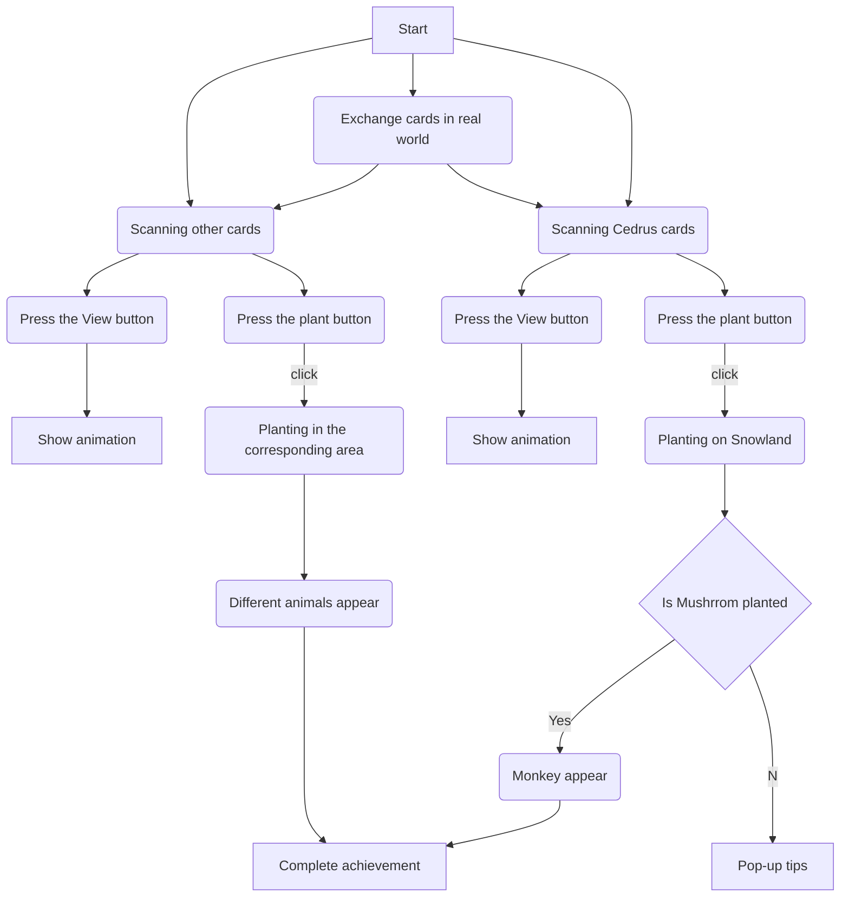

# ISLAND
## IMPORTANT

Since the project file was too large to upload to GitHub, please visit the Google drive link:https://drive.google.com/drive/folders/1jOGc4t22C0EEfBVvQTgmi63AQ2Ziq-kU


## introduction
Island is a game developed on Unity. In the game, the player will start having an empty island which will be shown on the screen. By collecting **physical cards** of different plants and scanning them by camera, the player can generate an augmented **reality (AR) model**. Then, the player can select the corresponding area to grow plants and click on the plants to unlock five different animals.Through the interaction with plants, players will gradually unlock and discover various animals, increasing the fun and exploration of the game.

After different plants are planted, different animals will be created with them. We hope that this game can make people pay attention to environmental protection and the protection of ecological diversity.

Island combines elements of placement games, biodiversity and augmented reality to provide players with a unique experience. Players will collect and **exchange cards with other players** in real world to eventually unlock all animals.

## The technologies we use
Unity

Blender

Adobe Illustrator

Ar SDK: Vuforia

## Game Flow


## What I did in this Project
### 1.Scene and Material in Unity

### 2.Code
I have written all the code for the game's functions.And I've uploaded the code to github:https://github.com/Yyyoung6699/Island/tree/main/Complete%20code
And here is the code for some of the main functions that I have selected (in case there are too many files):https://github.com/Yyyoung6699/Island/tree/main/Main%20code

1.TreeSpwan/GrassSpwan

From the main camera ray to the mouse position, the material of the intersection is detected.
```ruby
void RayCast()
{
    RaycastHit hit;
    if (Physics.Raycast(cam.ScreenPointToRay(Input.mousePosition), out hit))
    {
        // Check if the raycast hit an object with the "Ground" tag
        if (hit.collider.CompareTag("Ground"))
        {
            Vector3 hitPos = hit.point;
            MeshCollider meshCollider = hit.collider as MeshCollider;

            // Check if the collider has a mesh and retrieve it
            if (meshCollider != null || meshCollider.sharedMesh != null)
            {
                mesh = meshCollider.sharedMesh;
                Renderer renderer = hit.collider.GetComponent<MeshRenderer>();

                // Get the indices of the triangle that was hit
                int[] hitTriangle = new int[]
                {
                    mesh.triangles[hit.triangleIndex * 3],
                    mesh.triangles[hit.triangleIndex * 3 + 1],
                    mesh.triangles[hit.triangleIndex * 3 + 2]
                };

                // Iterate over all submeshes in the mesh
                for (int i = 0; i < mesh.subMeshCount; i++)
                {
                    int[] subMeshTris = mesh.GetTriangles(i);

                    // Iterate over each triangle in the submesh
                    for (int j = 0; j < subMeshTris.Length; j += 3)
                    {
                        // Check if the current triangle matches the hit triangle
                        if (subMeshTris[j] == hitTriangle[0] &&
                            subMeshTris[j + 1] == hitTriangle[1] &&
                            subMeshTris[j + 2] == hitTriangle[2])
                        {
                            mat = renderer.materials[i];

                            // Log the index of the submesh
                            Debug.Log(i);

                            // Call a function with the submesh index and hit position
                            LandCondition(i, hitPos);
                        }
                    }
                }
            }
        }
    }
}
```
Depending on the material, different plants are generated.
```ruby
void SpawnPlants(GameObject spawnPla, Vector3 hitPos)
    {
        audioSource.PlayOneShot(Sound);
        //int PlantsIndex = Random.Range(0, spawnPla.Length);
        hitPos = hitPos + Vector3.up * spawnPla.transform.localScale.y / 2;
        Instantiate(spawnPla, hitPos, Quaternion.identity);
    }
```
2.Interaction

By ray detection whether the GreenTree object hit, if hit, play animation, and based on the number of plants, generate animals.
```ruby
 if (hit.collider.CompareTag("GreenTree"))
            {
                Score = Score + 1;
                currentObject = hit.transform;
                Debug.Log(currentObject.name);
                Debug.Log(currentObject.position);
                growleave = currentObject.GetComponent<Grow>();
                growleave.PlayParticleEffect();
                
                GameObject[] animals = GameObject.FindGameObjectsWithTag("Animal");
                if (animals.Length > 0)
                {
                    Debug.Log("存在标记为'Animal'的对象");
                }
                else
                {
                    InsBird();
                }
            }
```
Generate the corresponding animal according to the plant, and play the sound effect, and light the achievement icon.
```ruby
void InsBird()
    {
        GameObject[] GreenTree = GameObject.FindGameObjectsWithTag("GreenTree");
        //int greenTrees = treeSpawn.GreenTrees;
        if (Random.value < 0.01f * GreenTree.Length)
        {
            GameObject birdInstance = Instantiate(Bird, currentObject.position, Quaternion.identity);
            BirdController birdController = birdInstance.GetComponent<BirdController>();
            TreePos = currentObject.position;
            birdController.SetCenterPoint(TreePos);
            treeSpawn.IncreasePlantNum(5);
            Score = Score + 100;
            Image image4 = GameObject.Find("Image (4)").GetComponent<Image>();
            Color color = image4.color;
            color.a = 1f; 
            image4.color = color;

            savedColor4 = image4.color;
            PlayerPrefs.SetString("ImageColor4", ColorUtility.ToHtmlStringRGBA(savedColor4));

        }
    }
```
3.BirdController(Different animals have different control codes)

Control animal movements based on plant location, play animal sounds, and generate interaction buttons.
```ruby
void Start()
{
    transform.localScale = Vector3.zero;
    sizeChange = true;
    randomSize = Random.Range(minSize, maxSize);

    // Get the initial position of the center point
    Vector3 centerPosition = centerPoint;
    transform.position = new Vector3(centerPosition.x, centerPosition.y + 15, centerPosition.z);

    audioSS = GetComponent<AudioSource>(); // Get the AudioSource component

    audioSS.clip = BirdAudio;
    audioSS.Play(); // Play the bird chirping sound

    screenPos = Camera.main.WorldToScreenPoint(centerPosition);
    Vector3 PPos = new Vector3(screenPos.x, screenPos.y + 140, screenPos.z);
    buttonBa = GameObject.Find("BtnCollection");
    if (buttonBa == null)
    {
        Debug.LogError("ButtonParent not found in the scene!");
    }
    else
    {
        print("ButtonParent was found!");
        // Generate a button at centerPosition
        GameObject buttonObject = Instantiate(buttonPre, PPos, Quaternion.identity);
        buttonObject.transform.SetParent(buttonBa.transform);
    }
}

void Update()
{
    SizeChange();

    // Calculate the position and lookahead position for the next frame
    angle += speed * Time.deltaTime;
    float x = centerPoint.x + Mathf.Cos(angle) * radius;
    float z = centerPoint.z + Mathf.Sin(angle) * radius;
    float y = centerPoint.y + (Mathf.Sin(1.5f * angle) * radius) / 3;
    Vector3 newPosition = new Vector3(x, y + 10f, z);

    // Calculate the lookahead position
    float aheadX = centerPoint.x + Mathf.Cos(angle + 0.1f) * (radius + aheadDistance);
    float aheadZ = centerPoint.z + Mathf.Sin(angle + 0.1f) * (radius + aheadDistance);
    Vector3 aheadPosition = new Vector3(aheadX, transform.position.y, aheadZ);

    // Update the position and orientation of the Sparrow_Animations object
    transform.position = newPosition;
    transform.LookAt(aheadPosition);
}

```
4.Grow

Both plants and animals contain this growth animation code.
```ruby
private void SizeChange()
    {
        if (sizeChange == true)
        {
            this.transform.localScale = Vector3.SmoothDamp(transform.localScale, currentScale * randomSize, ref currentVelocity, growSpeed);
            if ((currentScale.x * randomSize - transform.localScale.x) <= 0.01f)
            {
                transform.localScale = new Vector3(currentScale.x * randomSize, currentScale.y * randomSize, currentScale.z * randomSize);
                sizeChange = false;
            }
        }
    }
```
5.Test/Test2(Camera animation code)

Test is responsible for controlling the camera's approach to the animal and the recovery position, and Test2 is responsible for detecting and calling test after clicking the button.
```ruby
private void FixedUpdate()
{
    // If IsLookAtAppointTarget is true, move the MainCamera to the LookAtTargetPosition
    if (IsLookAtAppointTarget == true)
    {
        MainCamera.transform.position = Vector3.Lerp(MainCamera.transform.position, LookAtTargetPosition, Time.deltaTime * MainCameraMoveSpeed);
        MainCamera.orthographicSize = Mathf.Lerp(MainCamera.orthographicSize, 40f, Time.deltaTime * MainCameraMoveSpeed);
        MainCamera.transform.LookAt(LookAtTarget);

        // Check if the MainCamera has reached the desired orthographic size
        if (Mathf.Abs(40f - MainCamera.orthographicSize) <= 0.01f)
        {
            MainCamera.orthographicSize = 40f;
            IsLookAtAppointTarget = false;
        }
    }

    // If IsBack is true, move the MainCamera back to its original position
    if (IsBack == true)
    {
        MainCamera.transform.position = Vector3.Lerp(MainCamera.transform.position, LookAtTargetPosition, Time.deltaTime * MainCameraMoveSpeed);
        MainCamera.orthographicSize = Mathf.Lerp(MainCamera.orthographicSize, 128f, Time.deltaTime * MainCameraMoveSpeed);
        MainCamera.transform.rotation = Quaternion.Euler(19.31f, -24.7f, 3.5f);

        // Check if the MainCamera has reached the desired orthographic size
        if (Mathf.Abs(128f - MainCamera.orthographicSize) <= 0.01f)
        {
            MainCamera.orthographicSize = 128f;
            IsBack = false;
        }
    }
}

public void LookAtAppointTarget()
{
    if (LookAtTarget != null)
    {
        LookAtTargetPosition = new Vector3(125.0f, 173.0f - 50.0f, -334.0f);
        IsLookAtAppointTarget = true;
    }
    else
    {
        Debug.LogError(GetType() + "/LookAtAppointTarget()/The target object to look at does not exist. Please check!");
    }
}

```
### 3.Animation in Unity

